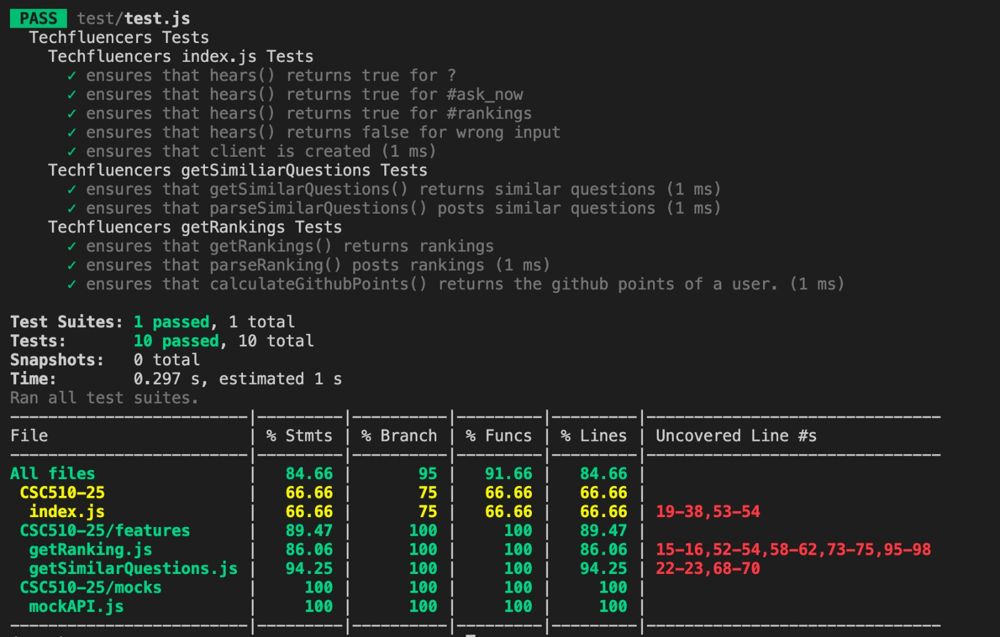

# BOT

## Tagline
Techfluencer - *Just Resolve it!*

## Bot Platform Implementation
The Platform chosen is MatterMost.
It has been implemented with Triggers.

* Bot Platform: The platform chosen is MatterMost. It responds to basic commands and has an inter-channel connectivity. We leveraged the template from WeatherBot.

* Bot Integration: The bot responds to user commands and is able to interact by responding with expected results. It also performs the necessary operations when specific keywords are fed to it, thus responding to triggers. For the Database and 3rd party APIs, we have successfully mocked the functionality.   

## Use Cases Refinement
###  Use Case 1: Asking a question
1. Preconditions  
User must have a Mattermost Profile and a Github profile. They can add a StackOverflow Profile as well.

2. Main Flow    
User will enter their question on the Mattermost Platform [S1]. Bot will respond to the user with a list of suggested Questions from StackOverflow [S2]. User can then click on a question of his choice [S3].  
	  
3. Subflows  
[S1] User simply adds a question to the Mattermost window and submits it.  
[S2] Bot will respond to the question with a list of suggested questions as a follow-up question in the Mattermost window.  
[S3] User can click on a related question which will lead him to the StackOverflow Website.  

###  Use Case 2: Updating the Database
1. Preconditions  
Everyday at 9PM the 3rd Party APIs are run to fetch the new data and update the database.

2. Main Flow   
At a set time of the day, the 3rd party APIs are run to GitHub and StackOverflow for each user in our Database [S1]. The data is then fetched from the returned JSON and used to calculate the points [S2]. The points are then updated to the Database [S3].

3. Subflows  
[S1] API calls for each user are executed to fetch the latest user activity data on GitHub and StackOverflow.  
[S2] Data collected is then used to calculate the points for the leaderboard.  
[S3] The edited points are then updated to the Database.  

###  Use Case 3: Fetching the Leaderboard
1. Preconditions  
User must have an account on Mattermost. A Database Connectivity is needed to fetch rank. User must make a request using the keywords mentioned.
2. Main Flow  
The user can ask for the leaderboard using the pattern '#rankings'[S1]. The bot query's the database at the backend [S2]. It returns a table with the current standings af all the users in the bot [S3].  

3. Subflows  
[S1] User simply types '#rankings' and presses Enter.  
[S2] Bot connects to the backend. It sends a query to the Database.  
[S3] The bot displays the fetched results to the users channel on MatterMost.  

4. Alternative Flow  
   [E1] An individual score can also be accessed by the user by entering a command on their channel. The command: "#my_rank"

## Testing
Functions Tested:-
* `hears()` in `index.js`,
* `getSimilarQuestions()` and `parseQuestion()` in `getSimilarQuestions.js`,
* `getRankings()`, `parseRanking()` and `calculateGithubPoints()` in `getRankings.js`  

Achieved coverage of 89.29% for all files:

## Mocking infrastructure   

* GitHub User Events API   
The GitHub Endpoint mocked for this functionality is: `GET/events`
We have mocked the response of this API for a single user. This is present in the `mocks/githubEvents.json` file. The *type* property of this JSON tells us the Event (commits) of the user. This is used to update the GitHub points for a particular user. For now we plan to use only the commits to calculate the score.

* StackOverflow Similar Questions API   
The StackOverflow Endpoint mocked for this functionality is: `GET/similar`
The idea of leveraging this API is to use the question entered by the user, to fetch similar questions from StackOverflow which eventually will be displayed to the user. We have successfully been able to use this API to retrieve similar questions and their web-links which are used to create hyperlinks and in turn sent as a message on MatterMost to the user.

* MatterMost Client Testing   
We have used JEST to mock the MatterMost Client in `test.js`. This mocked client intercepts the `POST` Message function to the client to check as to what is being displayed against the expected value.

## Screencast
Here is the Screencast for our BOT:
[Screencast Link](https://drive.google.com/file/d/19JsI0dDRKvMEPIHXtWMLfY5kvIO0O6aO/view?usp=sharing)
