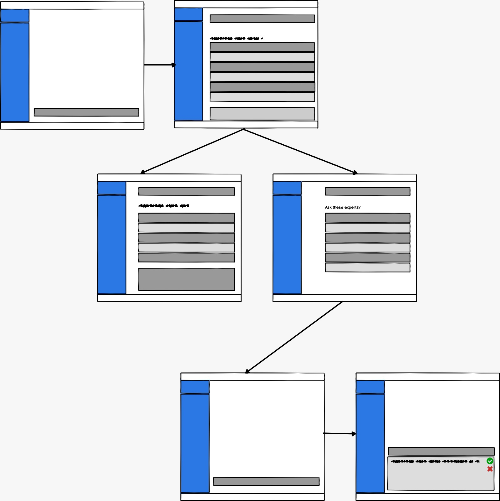
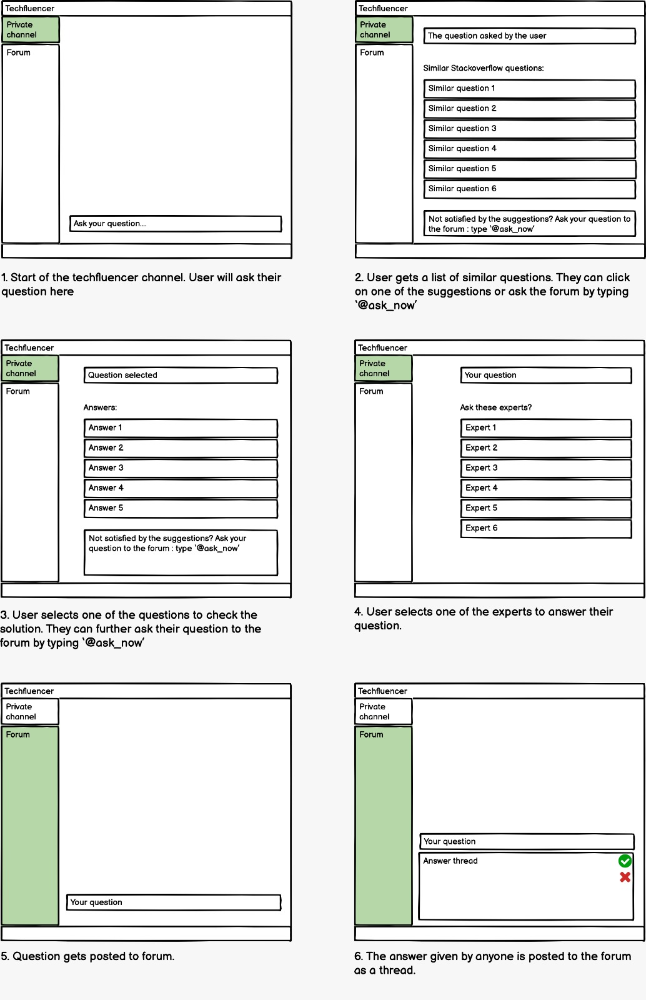
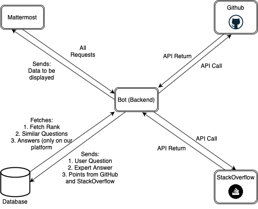

# Design 
Our bot design is based on the seed idea of Reward bot.

## Tagline
*Just Resolve it!*

## Problem Statement
The project aims at building a bot that rewards users based on their activity on platforms. It will also act as a QnA platform where users can ask questions and get answers from experts. The bot would monitor user activities like comments, commits, resolutions and general engagement activity on platforms like Github and StackOverflow. The content would then be monitored and the users will be rewarded.
The motive is to build a centralized platform where the users get a generalized score based on their technical prowess on 3rd party platforms (GitHub, StackOverflow) combined with activity on our platform. This can eventually be used to map ‘technical influencers’ to queries asked across platforms.

## Bot Description

- The information will be obtained from APIs for the platforms (GitHub, StackOverflow etc.). User specific data will be fetched.
- Post data fetching, the scoring for an activity will be completed based on a preset nomenclature and the level of engagement of the user. For example, commits get +2 points, resolutions to issues get +5 points, relevant comments get them +1 point. We will also be increasing the scores based on the keywords present in the activity and they can be scored based on the relevance (similarity) with the topic. The users will be assigned badges based on the levels of engagement that they fulfill.
- All these activities will eventually be tagged based on keywords to specific topics and the ‘influencers’ will be decided based on their credibility and activity in that domain. These influencers will then be assigned to contribute based on their expertise, to new queries that come on those platforms. The mapping will solely be done based on the query tags and influencer rating.

## Our Goal
We plan to implement this idea for two platforms but it can be scaled to more platforms whose APIs we can leverage.

## Use Cases
###  Use Case 1: Asking a question
1. Preconditions  
User must have a Mattermost Profile and a Github profile. They can add a StackOverflow Profile as well.

2. Main Flow    
User will enter their question on the Mattermost Platform [S1]. Bot will respond to the user with a list of suggested Questions from StackOverflow [S2]. User can then click on a question of his choice [S3].  
	  
3. Subflows  
[S1] User simply adds a question to the Mattermost window and submits it.  
[S2] Bot will respond to the question with a list of suggested questions as a follow-up question in the Mattermost window.  
[S3] User can click on a related question which will lead him to the StackOverflow Website.  

###  Use Case 2: Updating the Database
1. Preconditions  
Everyday at 9PM the 3rd Party APIs are run to fetch the new data and update the database.

2. Main Flow   
At a set time of the day, the 3rd party APIs are run to GitHub and StackOverflow for each user in our Database [S1]. The data is then fetched from the returned JSON and used to calculate the points [S2]. The points are then updated to the Database [S3].

3. Subflows  
[S1] API calls for each user are executed to fetch the latest user activity data on GitHub and StackOverflow.  
[S2] Data collected is then used to calculate the points for the leaderboard.  
[S3] The edited points are then updated to the Database.  

###  Use Case 3: Fetching the Leaderboard
1. Preconditions  
User must have an account on Mattermost. A Database Connectivity is needed to fetch rank. User must make a request using the keywords mentioned.
2. Main Flow  
The user can ask for the leaderboard using the pattern '#rankings'[S1]. The bot query's the database at the backend [S2]. It returns a table with the current standings af all the users in the bot [S3].  

3. Subflows  
[S1] User simply types '#rankings' and presses Enter.  
[S2] Bot connects to the backend. It sends a query to the Database.  
[S3] The bot displays the fetched results to the users channel on MatterMost.  

4. Alternative Flow  
   [E1] An individual score can also be accessed by the user by entering a command on their channel. The command: "#my_rank"
  
## Design Sketches
### Wireframe
This depicts our main flow("happy flow")

### Storyboard

## Architecture Design

### Components
- **Git API**: The bot takes user information from github through the git api. This includes user activities such as commits, issues, etc. and their association with certain “tags”.
- **Stackoverflow API**: Bot takes user activity data from stackoverflow. It also fetches questions and answers corresponding to a related question asked on the platform.
- **Database**: The database is used to store user scores and rankings relative to tags and question and answer threads. The QnA thread also has information upvote/downvote information
- **Bot**: 
   - Back-end: The bot collects user data from git and stackoverflow to compute score corresponding to different tags as well as overall score. This data is stored in the database. When a user inputs a question, the bot fetches questions with similar titles from stackoverflow and its own database. These questions are presented to the user. If the user is not satisfied with the pre-existing answers, the user can elaborate further on their query and associate tags to their question. The bot then fetches rankings for the particular set of tags from the database and the question gets posted on the forum and stored in the database as a new thread.  
   - Front-end: 
        - User Stats : A message that shows the user’s overall score and the score relative to the tags.
        - QnA: An interface for the user to ask questions or provide answers to pre-existing questions.

### Interactions
- Bot to Github:
Our bot would send a request to GitHub using the API to fetch all the data regarding the user’s activity and the tags the user has worked on.

- GitHub to Bot:
Based on the request sent by the Bot, GitHub would send the response using the API and the Bot will then perform computations on it.

- Bot to StackOverflow:
Our bot would send a request to StackOverflow using the API to fetch all the data regarding the user’s activity and the tags the user has worked on.

- StackOverflow to Bot:
Based on the request sent by the Bot, StackOverflow would send the response using the API and the Bot will then perform computations on it.

- Bot to Mattermost:
After fetching all the required data from the Database based on the API, the response is sent to Mattermost where it displays it.

- Mattermost to Bot:
Every request made by the user would be sent to our Bot, which then processes the request and performs the actions accordingly.

- Bot to Database:
Whenever the Bot needs to update the ranks of the user, or store the questions asked then the Bot sends the data to the Database.

- Database to Bot:
On fetching the query by the Bot the Database will send the response to the Bot via an API.

### Constraints
- Bot cannot send data from one user to another. Each interaction always goes through the Bot (Backend).The interaction takes place using the Mattermost Frontend.
- Credentials are necessary for the users to start using the platform.
- Experts can answer questions any time they want, they do not necessarily need to be notified about it.

### Design Patterns
- Singleton:
The Singleton design pattern ensures that only a single instance of a class is created. As the API keys that we will be using would require only one instance to be created we would go for a Singleton design pattern. This can be done by storing all the configuration related variables in a single config file and use it’s instance whenever the operations need to be performed.

- Command:
The different interactions between the components of the system, for requesting and exchanging data is handled by commands made by them to each other. Each Request command is usually in the form of an API call to 3rd party extensions, and it returns the necessary response in the form of an object. The data returned is then used in the necessary form and passed on to the objects where it could be necessary.

